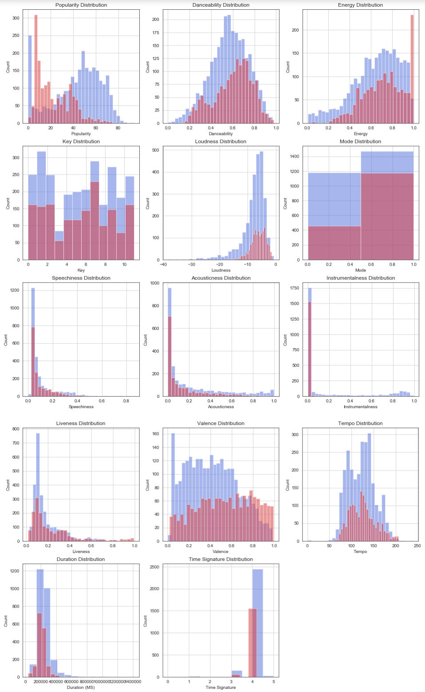
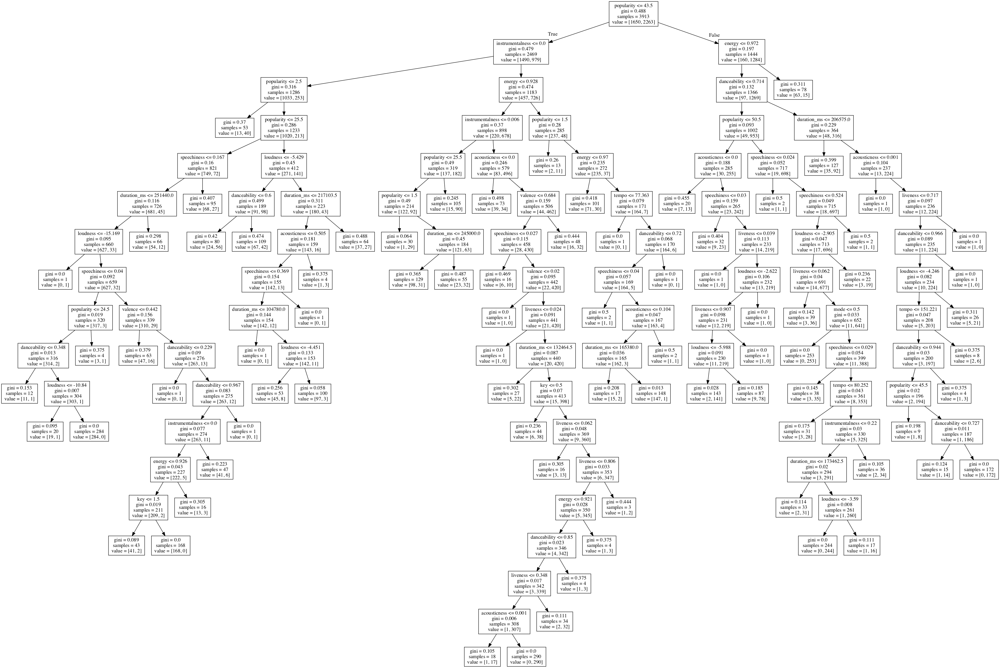

# DiscoverDaily

A Recommender System that uses scikit-learn and the Spotify API.

Analyzes your Spotify library - including likes and dislikes - to produce music recommendations for you every day.

### Exploratory Data Analysis of my musical taste

### The Decision Tree Classifier

### Use

You will need a Spotify Client ID and Client SECRET. See: [Spotify Authorization](https://developer.spotify.com/dashboard/applications)

The application will analyze your library, as well as over 2000 songs that I have arbitrarily deemed 'bad'.

If you wish to use the standalone python script, 

* See [spotipy env](https://spotipy.readthedocs.io/en/latest/#authorization-code-flow)

    * export your SPOTIPY_USERNAME, SPOTIPY_CLIENT_ID, SPOTIPY_CLIENT_SECRET, and SPOTIPY_REDIRECT_URI

* run discoverdaily.py

* args:

    * playlist_length: number of track recommendations to generate

    * interval: number of minutes between script executions (default = 1440, 24 hours)
    

If you wish to use the Jupyter Notebooks, run them in this order:
* wrangling.ipynb
* eda.ipynb (OPTIONAL)
* recommender_tree.ipynb

### Development

Written in Python.

Dependencies: 

* sklearn for machine learning

* pandas for data management

* Spotipy, a wrapper around the Spotify API

* graphviz for tree visualization

## Author

Noah Tigner

nzt@cs.uoregon.edu

### References
* EDA code from Wes Doyle

